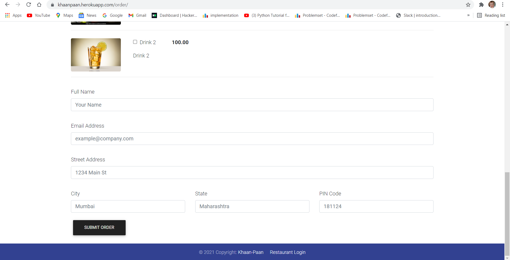
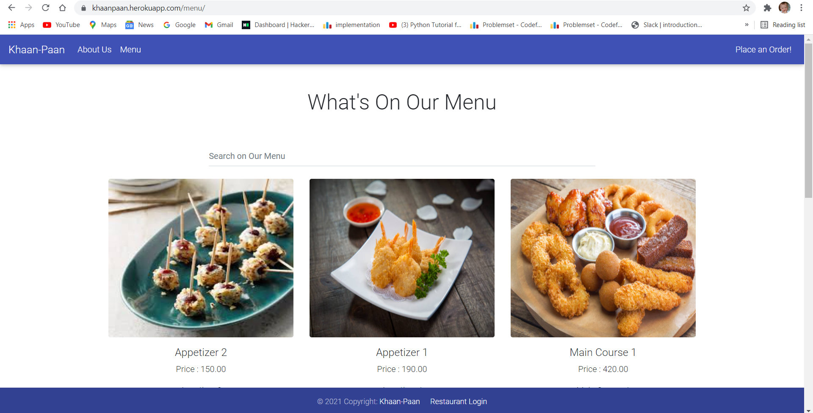
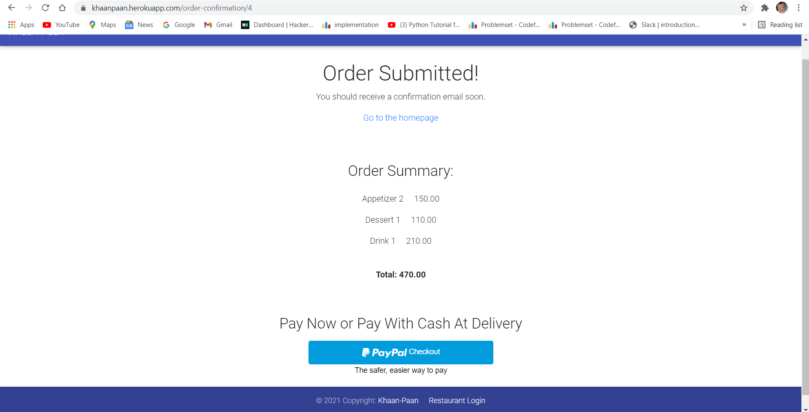
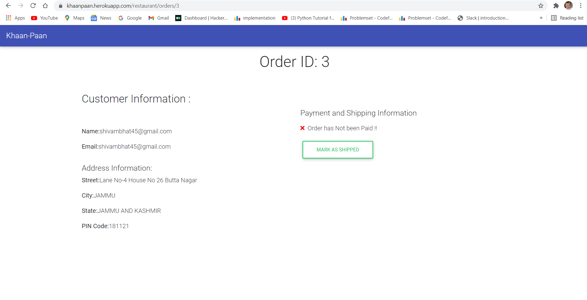
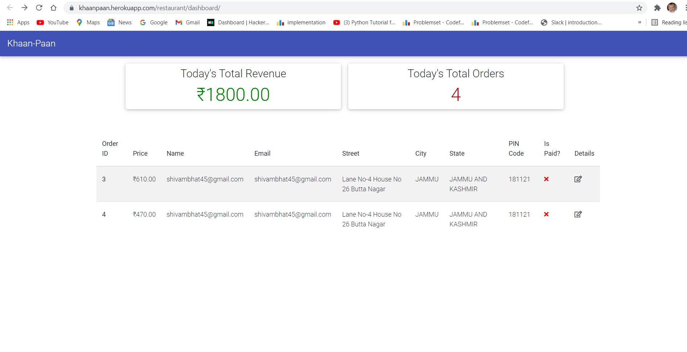

# <a href="https://khaanpaan.herokuapp.com/">KhaanPaan</a>

A Fully Functional Website deployed on heroku and in which you can order Food of your own choice and enabled with email notification also it has a two kinds of payment option available either pay
using PayPal Platform or by COD . There is a dedicated space for the administrator to view all the orders,total sales of the day and also notifying the customer that their food has been departed from the restaurant

## Food Ordering Website
Customer Side View

Admin Side View

For Backend Storage I have used Cloudinary Storage (Only 25 GB Free)

## License & Copyright
© Shivam Bhat, YMCA Faridabad
